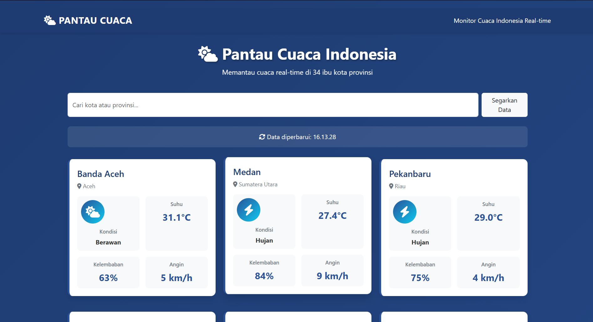
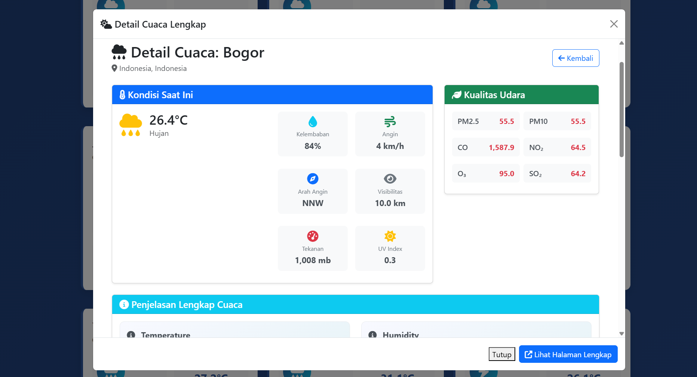

🌦️ PANTAU CUACA

📌 Deskripsi
Pantau Cuaca adalah aplikasi web berbasis Laravel yang digunakan untuk memantau kondisi cuaca secara real-time di berbagai ibu kota provinsi di Indonesia. Aplikasi ini memanfaatkan layanan API cuaca eksternal untuk menampilkan informasi terkini seperti suhu, kondisi cuaca, dan kelembaban udara.

Aplikasi ini dirancang sebagai solusi sederhana untuk membantu pengguna mendapatkan informasi cuaca secara cepat, akurat, dan mudah diakses melalui web.

---

🌐 Production URL

Aplikasi ini telah di-deploy dan dapat diakses di: [pantaucuaca-production.up.railway.app](https://pantaucuaca-production.up.railway.app)

---

🖼️ Screenshot Aplikasi




---

🚀 Fitur Utama

* 🌍 Menampilkan cuaca di beberapa kota (ibu kota provinsi)
* 🌡️ Informasi suhu secara real-time
* 🌤️ Kondisi cuaca (cerah, hujan, berawan, dll.)
* 💧 Kelembaban udara
* 🔄 Update data otomatis dari API cuaca
* 📱 Tampilan responsif (mobile-friendly)

---

🛠️ Teknologi yang Digunakan

* Backend: Laravel 11
* Frontend: Blade Template, Bootstrap, Vite
* HTTP Client: Laravel HTTP (API Integration)
* Database: SQLite (default, opsional)
* API Cuaca: WeatherAPI

---

⚙️ Instalasi

1. Clone Repository

```bash
git clone https://github.com/AwaludinMajid/pantau-cuaca.git
cd pantau-cuaca
```

2. Install Dependency

```bash
composer install
npm install
```

3. Setup Environment

```bash
cp .env.example .env
php artisan key:generate
```

4. Konfigurasi API Key
   Daftar di:
   👉 [https://www.weatherapi.com/](https://www.weatherapi.com/)

Masukkan API key ke `.env`:

```env
WEATHER_API_KEY=your_api_key_here
```

5. Konfigurasi Database (Opsional)

```bash
php artisan migrate
```

6. Build Frontend

```bash
npm run build
```

Untuk development:

```bash
npm run dev
```

---

7. Jalankan Aplikasi

🚀 Opsi 1: Server Stabil (Direkomendasikan)

```bash
php -S 127.0.0.1:8000 -t public
```

🚀 Opsi 2: Laravel Artisan (Development)

```bash
php artisan serve
```

🚀 Opsi 3: Auto-Restart Server (Windows)

```bash
.\start_server.ps1
```

Atau klik file `start_server.bat`

🚀 Opsi 4: Web Server (Production)

* Apache / Nginx
* Docker (Laravel Sail)
* Laragon

---

📡 Akses Aplikasi
Buka di browser:

```
http://127.0.0.1:8000
```

---

🔧 Troubleshooting Server

❌ "Can't reach this page" / server mati?

Solusi:

1. Gunakan PHP built-in server

```bash
php -S 127.0.0.1:8000 -t public
```

2. Auto-restart script
   Jalankan `start_server.ps1`

3. Cek port conflict

```bash
netstat -ano | findstr :8000
```

4. Tambah memory limit (`php.ini`)

```ini
memory_limit = 512M
max_execution_time = 300
```

5. Gunakan web server (Laragon/XAMPP/Docker)

⚡ Tips:

* Clear cache:

```bash
php artisan view:clear
```

* Restart server jika ada perubahan besar

---

🧪 Testing

```bash
php artisan test
```

---

📂 Struktur Proyek

app/
└── Http/
└── Controllers/
└── WeatherController.php

resources/
└── views/
└── dashboard.blade.php

routes/
└── web.php
